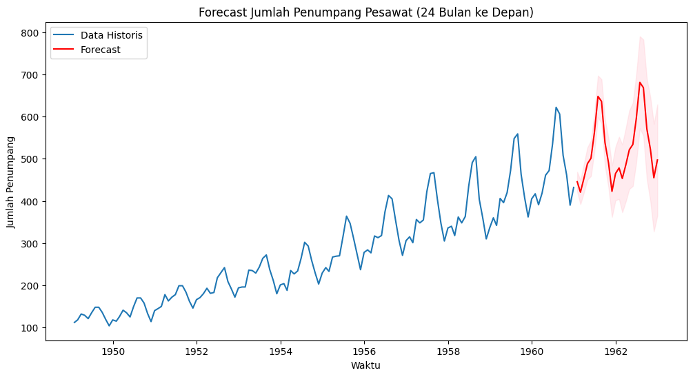

# Time-Series-Forecasting-AirPassengers-Dataset
Proyek ini bertujuan untuk menganalisis data deret waktu (time series) jumlah penumpang pesawat bulanan (1949–1960) menggunakan model ARIMA dan SARIMA.   Dataset yang digunakan adalah AirPassengers dari statsmodels.datasets.

Analisis dilakukan mengikuti alur pembelajaran yang sistematis sesuai referensi:
- **Part 1:** Konsep dasar Time Series (stationarity, ACF/PACF, ARIMA).
- **Part 2:** Implementasi ARIMA/SARIMA, pemilihan model, evaluasi residual, dan forecasting.

---

## Langkah Analisis

1. **Eksplorasi Data**
   - Data menunjukkan **tren naik jangka panjang** dan **pola musiman tahunan (seasonality)**.
   - Kesimpulan awal: data **tidak stasioner**.

2. **Uji Stasioneritas (ADF Test)**
   - Data asli → p-value tinggi (tidak stasioner).
   - Differencing (d=1) → borderline stasioner.
   - Diputuskan menggunakan **d=1**.

3. **Identifikasi Model (ACF & PACF)**
   - Kandidat ARIMA diuji: (1,1,0), (1,1,1), (2,1,0), (2,1,1).

4. **Pemilihan Model (AIC/BIC)**
   - ARIMA(2,1,1) memiliki AIC/BIC terendah di antara kandidat non-seasonal.
   - Namun residual masih menunjukkan autocorrelation (Ljung-Box Test signifikan).

5. **SARIMA**
   - Untuk menangkap pola musiman (m=12), diuji model SARIMA:
     - SARIMA(2,1,1)(1,1,0,12) → **AIC = 923.85 (terbaik)**
     - SARIMA(2,1,1)(1,1,1,12) → AIC = 924.31
   - Residual dari SARIMA(2,1,1)(1,1,0,12) menyerupai **white noise**.

6. **Forecasting**
   - Prediksi 24 bulan ke depan (1961–1962).
   - Hasil forecast menunjukkan tren **jumlah penumpang meningkat** dengan pola musiman tahunan yang konsisten.
   - Interval kepercayaan semakin melebar seiring waktu (ketidakpastian jangka panjang).

---

## Hasil Visualisasi
  
*Forecast 24 bulan ke depan menggunakan SARIMA(2,1,1)(1,1,0,12)*

---

## Kesimpulan
- Model terbaik: **SARIMA(2,1,1)(1,1,0,12)**.  
- Model berhasil menangkap **tren dan seasonality**.  
- Forecast konsisten dengan pola historis dan dapat digunakan untuk:
  - **Perencanaan kapasitas penerbangan**  
  - **Strategi pemasaran** (high season vs low season)  
  - **Pengembangan infrastruktur bandara**  

---

## Struktur Notebook
1. Eksplorasi data  
2. Uji stasioneritas (ADF Test)  
3. Identifikasi model (ACF & PACF)  
4. ARIMA model selection  
5. Evaluasi residual ARIMA  
6. SARIMA model selection  
7. Evaluasi residual SARIMA  
8. Forecasting & Kesimpulan  

---

---

## Author
Project ini dibuat sebagai bagian dari pembelajaran **Data Science / Time Series Forecasting** untuk portofolio.  
